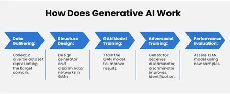
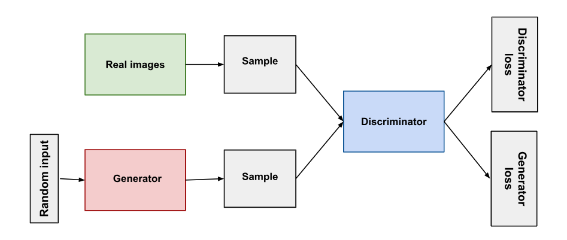
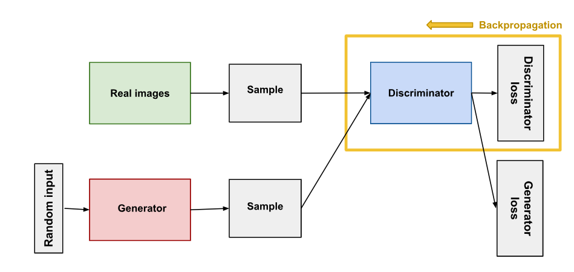
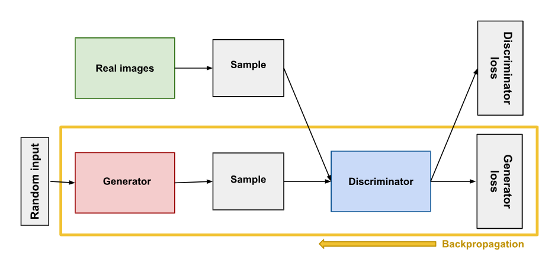
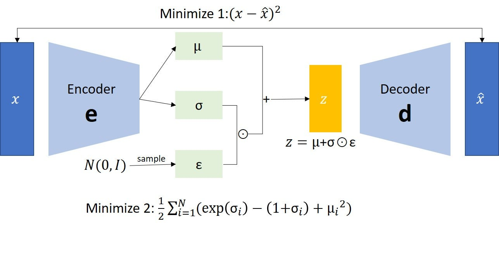
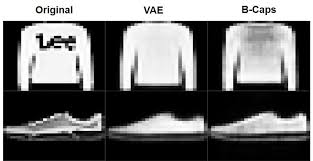
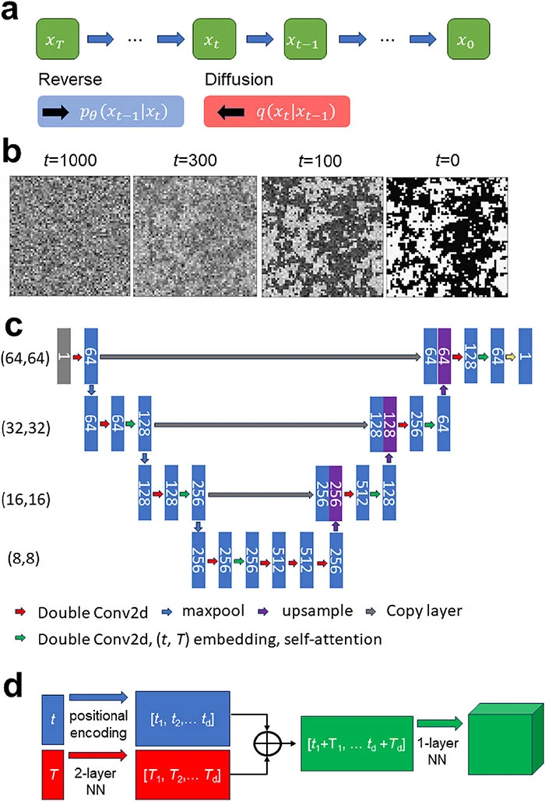

# Blog : Generative AI en Computer Vision

## Table des matières
1. [Introduction au Generative AI en Computer Vision](#introduction-au-generative-ai-en-computer-vision)
   - [C'est quoi le Generative AI ?](#cest-quoi-le-generative-ai-)
   - [C'est quoi le Generative AI en Computer Vision ?](#cest-quoi-le-generative-ai-en-computer-vision-)
   - [Un peu d'histoire](#un-peu-dhistoire)
   - [Les outils populaires](#les-outils-populaires)
   - [Pourquoi utiliser le GenAI en Computer Vision ?](#pourquoi-utiliser-le-genai-en-computer-vision-)
2. [Explication ELI5 de l'architecture GAN](#2-explication-eli5-de-larchitecture-gan)
   - [Le Discriminateur](#le-descriminateur-)
   - [Le Générateur](#le-générateur-)
   - [Avantages & Limites](#avantages-et-limites)
3. [VAE — Variational Autoencoder](#3-vae--variational-autoencoder)
   - [C'est quoi ? (ELI5)](#cest-quoi--eli5)
   - [Analogie : machine à smoothies magique](#lanalogie--la-machine-à-smoothies-magique)
   - [Architecture](#architecture--comment-ça-marche)
   - [Fonction de perte](#la-fonction-de-perte-loss-function)
   - [Avantages](#avantages-du-vae)
   - [Limites](#limites-du-vae)
   - [Exemple concret](#exemple-concret--reconstruction-de-vêtements-avec-un-vae)
4. [Modèles de Diffusion et Analyse Comparative](#modèles-de-diffusion-et-analyse-comparative-des-architectures-génératives)
   - [Qu'est-ce qu'un modèle de diffusion ?](#quest-ce-quun-modèle-de-diffusion--eli5)
   - [Analogie](#analogie--lexpert-en-restauration-dimages)
   - [Diagramme du processus](#diagramme-du-processus)
   - [Comment ça marche](#comment-ça-marche-en-pratique)
   - [Avantages & Limites](#avantages-et-limites)
   - [Tableau comparatif](#tableau-comparatif-des-architectures)
   - [Conclusion](#conclusion-du-blog)

---

# Introduction au Generative AI en Computer Vision

## C'est quoi le Generative AI ?

Le Generative AI est un type d'intelligence artificielle
capable de créer du contenu (images, audio, texte) en
apprenant à partir de données existantes.

## C'est quoi le Generative AI en Computer Vision ?

En Computer Vision, le GenAI apprend à partir de milliers
d'images réelles pour ensuite générer de nouvelles images
qui n'ont jamais existé.

C'est comme un enfant qui regarde des milliers de dessins
de chats, et qui finit par pouvoir en dessiner un tout seul.



## Un peu d'histoire

Le GenAI en Computer Vision est une technologie récente.
Tout a commencé en 2014 avec l'invention des GANs
(Generative Adversarial Networks). Depuis 2022, avec
l'apparition d'outils comme DALL-E et Stable Diffusion,
cette technologie est devenue accessible à tout le monde.

## Les outils populaires

Aujourd'hui il existe plusieurs outils célèbres :

- **DALL-E** (OpenAI) : tu décris une image en texte,
  il la génère automatiquement
- **Midjourney** : très utilisé par les designers
  et les artistes
- **Stable Diffusion** : gratuit et open source,
  accessible à tous

## Pourquoi utiliser le GenAI en Computer Vision ?

En Computer Vision, entraîner un modèle nécessite
énormément de données. Le GenAI permet de générer
ces données artificiellement quand on n'en a pas assez.

**Exemple concret :** Dans un projet de lecture de
matricules de voitures (OCR), on peut générer
automatiquement des milliers de plaques d'immatriculation
différentes pour entraîner le modèle, sans avoir à les
photographier une par une.


---

## 2. Explication ELI5 de l'architecture GAN

Un réseau antagoniste génératif (GAN) se compose de deux parties:
*	**Le générateur** apprend à générer des données plausibles. Les instances générées deviennent des exemples d'entraînement négatifs pour le discriminateur.
*	**Le discriminateur** apprend à distinguer les données factices du générateur des données réelles. Le discriminateur pénalise le générateur pour la production de résultats invraisemblables.
Analogie Simple :
Imagine :
*	Un faussaire qui imprime de faux billets 
*	Un policier qui détecte les faux 
Le cycle :
1.	Le faussaire crée un faux billet 
2.	Le policier dit : “FAUX ” 
3.	Le faussaire s’améliore 
4.	Le policier devient plus intelligent 
Résultat final : Les faux billets deviennent indétectables

Architecture global :
 



## Le descriminateur :
Le Discriminateur est le juge du GAN — un réseau de neurones classique entraîné à répondre à une seule question : cette donnée est-elle réelle ou fabriquée ? Concrètement, il reçoit en entrée tantôt une vraie image issue du dataset, tantôt une image synthétique produite par le Générateur, sans jamais savoir à l'avance laquelle est laquelle. À travers ses couches successives, il extrait des indices de plus en plus abstraits — textures et bords en premier, puis formes et structures, enfin cohérence globale — avant de condenser tout cela en un unique score entre 0 et 1 : proche de 1 s'il pense avoir affaire à du réel, proche de 0 s'il flaire le faux. C'est un classificateur binaire dans sa forme, mais son rôle dans le GAN va bien au-delà : chaque fois qu'il se trompe, l'erreur remonte comme un signal d'apprentissage non seulement dans ses propres couches, mais aussi jusqu'au Générateur — lui indiquant précisément où son imitation a craqué. Le Discriminateur n'est donc pas seulement un détecteur, il est le professeur silencieux qui force le Générateur à progresser.
Le Discriminateur est simplement un classificateur.
 Son job :
1.	Il reçoit : 
	* des données réelles 
	* des données générées 
2.	Il fait une prédiction (réel ou fake) 
3.	On calcule une perte (erreur) : 
    * erreur si une vraie donnée est classée fake 
    * erreur si une fausse est classée réelle 
4.	Il met à jour ses poids via backpropagation 
Comment il apprend ?
	* Le discriminateur apprend grâce à ses erreurs.
Pendant l'entraînement du discriminateur:
1.	Le discriminateur classe à la fois les données réelles et les données factices du générateur.
2.	La perte du discriminateur pénalise le discriminateur pour avoir mal classé une instance réelle comme fausse ou une instance fausse comme réelle.
3.	Le discriminateur met à jour ses poids via la propagation inverse à partir de la perte du discriminateur via le réseau du discriminateur.


 
## Le générateur : 

La partie générateur d'un GAN apprend à créer de fausses données en intégrant les commentaires du discriminateur. Il apprend à faire en sorte que le discriminateur classe sa sortie comme réelle.
L'entraînement du générateur nécessite une intégration plus étroite entre le générateur et le discriminateur que l'entraînement du discriminateur. La partie du GAN qui entraîne le générateur comprend les éléments suivants:
* 	entrée aléatoire
* 	réseau générateur, qui transforme l'entrée aléatoire en instance de données
* 	un réseau discriminateur, qui classe les données générées
* 	sortie du discriminateur
*   perte du générateur, qui pénalise le générateur pour ne pas avoir réussi à tromper le discriminateur
 


- Bruit aléatoire -> Generator -> Image générée ->Discriminator (juge)

Les étapes : 
1.	Le Générateur reçoit un vecteur aléatoire (ex: distribution normale) 
2.	Il génère une fausse donnée 
3.	Le Discriminateur analyse cette donnée 
4.	Si le Discriminateur détecte que c’est faux : 
	o Une erreur est calculée 
5.	Cette erreur est renvoyée au Générateur 
6.	Le Générateur met à jour ses poids (backpropagation) 

Objectif : maximiser les chances de tromper le Discriminateur

Mise à jour :

Il ajuste ses paramètres via :

Backpropagation (indirecte)

## Avantages et Limites :

| Critère | Avantage | Limite |
|---------|----------|--------|
| Qualité visuelle | Photoréalisme exceptionnel | Artefacts sur les détails fins |
| Entraînement | Non supervisé | Instable, sensible aux hyperparamètres |
| Diversité | Espace latent riche | Mode collapse possible |
| Évaluation | — | Pas de métrique universelle fiable |
| Vitesse | Inférence quasi-instantanée | Entraînement très coûteux |
| Flexibilité | Nombreuses variantes | Chaque variante demande un réglage spécifique |


---

## 3. VAE — Variational Autoencoder


### C'est quoi ? (ELI5)

Imagine que tu es un enfant qui apprend à dessiner des visages. Tu regardes des centaines de visages et tu remarques ce qui les différencie : la taille des yeux, du nez, du sourire...

Ton cerveau crée mentalement une petite liste de **"curseurs"** pour résumer chaque visage :
- Yeux : petits (1) → grands (10)
- Nez : fin (1) → large (10)
- Sourire : neutre (1) → large (10)

**C'est exactement ce que fait un VAE.** Il apprend à résumer une image en quelques chiffres clés, puis il sait recréer des images à partir de chiffres qu'il n'a jamais vus auparavant.

---

### L'analogie : la machine à smoothies magique

Pense à un VAE comme une **machine à smoothies magique** dans une cuisine :

| Élément du VAE | Analogie smoothie |
|---|---|
| **Encodeur** | Le chef qui analyse ton smoothie : *"environ 60% mangue, 30% banane, 10% fraise"* |
| **Espace latent** | Le carnet de recettes universel (chaque image = une recette en chiffres) |
| **Décodeur** | La machine qui repart de la recette pour recréer un smoothie |
| **La magie** | On peut inventer une recette inédite → elle crée quand même quelque chose de cohérent ! |

>  **La vraie différence avec un simple autoencoder :** au lieu de mémoriser un point exact (*"60% mangue"*), le VAE mémorise une **fourchette** (*"entre 55% et 65% mangue"*). Cette incertitude volontaire est ce qui lui permet de **générer** de nouvelles images.

---

###  Architecture — comment ça marche



*Architecture complète du VAE : l'encodeur produit μ et σ, un bruit ε est échantillonné depuis N(0,I), puis z = μ + σ⊙ε est décodé pour reconstruire x̂. Deux pertes sont minimisées simultanément : la reconstruction (x - x̂)² et la KL-divergence.*

Le VAE est composé de **deux réseaux de neurones** :

**1. L'encodeur**
Il prend une image en entrée et la compresse en deux vecteurs :
- **μ (mu)** = la moyenne (le "centre" de la représentation dans l'espace latent)
- **σ (sigma)** = l'écart-type (l'incertitude, la "marge d'erreur")

Là où un autoencoder classique encode en *un point fixe*, le VAE encode en *une distribution gaussienne*. C'est la différence fondamentale.

**2. Le décodeur**
Il prend un point **z** échantillonné depuis N(μ, σ²) et reconstruit l'image.
C'est ce **z** qu'on peut aussi *inventer* pour générer de nouvelles images jamais vues.

---

### La fonction de perte (Loss Function)

Le VAE optimise **deux choses simultanément** :

| Perte | Formule (simplifiée) | Rôle |
|---|---|---|
| **Reconstruction** | ‖x - x̂‖² | L'image reconstruite doit ressembler à l'original |
| **KL-divergence** | KL(q(z\|x) ‖ p(z)) | L'espace latent doit rester organisé et continu |

```
Loss totale = Reconstruction Loss + β × KL Loss
```

> Sans la perte KL, les représentations seraient éparpillées dans l'espace latent — impossible de naviguer entre elles ou d'en créer de nouvelles de façon cohérente.

---

### Avantages du VAE

- **Espace latent continu et interpolable** : on peut glisser doucement d'une image à une autre (interpolation entre deux visages, par exemple)
- **Génération contrôlable** : modifier une dimension latente = modifier un attribut précis (âge, sourire, lunettes...)
- **Entraînement stable** : pas de jeu adversarial comme dans les GANs → beaucoup plus facile à entraîner
- **Apprentissage non supervisé** : le VAE n'a pas besoin de labels, il apprend seul à organiser les données

---

### Limites du VAE

- **Images floues** : c'est la critique principale. En optimisant pixel par pixel (MSE), le VAE "moyenne" les possibilités → résultat moins net que les GANs ou les Diffusion Models
- **Compromis reconstruction / régularisation** : plus l'espace latent est régulier (KL élevée), moins la reconstruction est fidèle — ce curseur est difficile à calibrer
- **Hypothèse gaussienne** : la vraie distribution des données est souvent bien plus complexe qu'une gaussienne

---


> *Le VAE est un artiste qui résume chaque œuvre par une recette approximative, puis invente de nouvelles œuvres en mélangeant des recettes — le résultat est cohérent mais parfois un peu flou.*

## Exemple concret : reconstruction de vêtements avec un VAE

Un Variational Autoencoder (VAE) peut apprendre à représenter des objets comme des vêtements ou des chaussures, puis tenter de les reconstruire à partir de cette représentation.

Dans cet exemple, le modèle est entraîné sur des images issues du dataset *Fashion MNIST*. Une image est ensuite donnée en entrée au modèle, qui essaie de la reconstruire après l’avoir compressée dans un espace latent.



**Explication :**

- **Original** : image réelle (pull ou chaussure)  
- **VAE** : image reconstruite par le modèle  
- **B-Caps** : autre méthode utilisée pour comparaison  

On observe que le VAE parvient à reproduire la forme générale de l’objet. Cependant, les images reconstruites sont légèrement floues, ce qui constitue une limitation classique de ce modèle.

### Interprétation

Le VAE peut être vu comme un système qui apprend à résumer une image sous forme de variables latentes, puis à la reconstruire à partir de ce résumé. La reconstruction reste cohérente, mais perd en précision.

### Conclusion

Cet exemple montre que le VAE comprend la structure globale des données et peut les reconstruire. Toutefois, en raison de son approche probabiliste, les résultats sont généralement moins nets que les images originales.

---

# Modèles de Diffusion et Analyse Comparative des Architectures Génératives


## Qu'est-ce qu'un Modèle de Diffusion ? (ELI5)

Commencez par une image **claire** et **nette**.

Maintenant, dégradez-la progressivement en ajoutant du **bruit aléatoire**, étape par étape, jusqu'à ce qu'elle devienne complètement brouillée — comme un écran de télévision sans signal.

Un modèle est ensuite entraîné à faire l'inverse : apprendre à **supprimer ce bruit** étape par étape afin de récupérer quelque chose qui ressemble à l'original.

Une fois entraîné, le modèle devient capable de quelque chose de plus puissant :

> **Il peut partir d'un bruit purement aléatoire et générer une image réaliste entièrement nouvelle.**

C'est exactement ainsi que fonctionnent *Stable Diffusion*, *DALL-E* et *Midjourney*.

---

## Analogie : L'Expert en Restauration d'Images

Imaginez un professionnel spécialisé dans la restauration de photographies endommagées.

| **Étape** | **Ce que fait l'expert** |
| :--- | :--- |
| **Point de départ** | Part d'une photo parfaite et de haute qualité |
| **Destruction contrôlée** | La photo est délibérément endommagée, couche par couche |
| **Apprentissage** | L'expert apprend comment inverser chaque étape de détérioration |
| **Création** | L'expert produit une image cohérente en partant uniquement du chaos |

> ★ *"Apprendre à détruire pour apprendre à créer."*

---

## Diagramme du Processus

**Diagramme — Processus de diffusion direct et inverse (DDPM)** *Source : ResearchGate — Ghojogh & Ghodsi (2024)*


**Diagramme — Schéma du modèle de diffusion incluant l'architecture U-Net** *Source : ResearchGate*



### Processus Direct (Diffusion) — Ajout de bruit
```text
Image (t=0)  -->  Légèrement bruitée (t=T/2)  -->  Bruit pur (t=T)
               (+ ajout de bruit gaussien à chaque étape)

```
### Processus Inverse (Génération) — Suppression du bruit
```text
Bruit pur (t=T)  -->  Partiellement débruitée (t=T/2)  -->  Image générée (t=0)
               (- le réseau prédit et soustrait le bruit)

```

## Comment ça Marche en Pratique

L'ensemble du processus se décompose en deux phases distinctes :

* **Phase 1 — Processus Direct** : On ajoute du bruit de manière mathématique. Après environ **1000 étapes**, l'image originale a totalement disparu pour devenir un bruit gaussien pur.
* **Phase 2 — Processus Inverse** : Un réseau de neurones (souvent un **U-Net**) apprend à estimer la quantité de bruit présente dans une image à chaque étape pour l'enlever progressivement.

### Variantes de Modèles

| **Modèle** | **Caractéristique clé** |
| :--- | :--- |
| **DDPM** | La formulation originale (1000 étapes de calcul) |
| **DDIM** | Version accélérée (nécessite beaucoup moins d'étapes) |
| **Stable Diffusion** | Travaille dans un **espace latent** (plus léger en mémoire) |
| **DALL-E 3** | Utilise l'attention croisée pour suivre des instructions texte |

---

## Avantages et Limites

### Points Forts
* **Qualité Supérieure** : Produit les images les plus réalistes et détaillées actuellement.
* **Diversité** : Grande variété de résultats (évite le phénomène de "mode collapse").
* **Stabilité** : Processus d'entraînement beaucoup plus stable que celui des GAN.

### Points Faibles
* **Lenteur** : Nécessite de nombreux calculs successifs pour générer une seule image.
* **Ressources** : Demande une puissance de calcul (GPU) très importante.
* **Complexité** : L'espace interne est moins "lisible" ou structuré que celui des VAE.

---

## Tableau Comparatif des Architectures

| **Critère** | **GAN** | **VAE** | **Modèles de Diffusion** |
| :--- | :--- | :--- | :--- |
| **Concept** | Duel entre 2 réseaux | Compression / Décompression | Inversion du bruit |
| **Qualité Image** | Très nette | Souvent un peu floue | **Exceptionnelle** |
| **Vitesse** | **Très rapide** | **Très rapide** | Lente (itérative) |
| **Stabilité** | Très instable | Stable | **Très stable** |
| **Exemples** | StyleGAN | VQ-VAE | **Midjourney, DALL-E** |

---

## Conclusion du Blog

L'évolution de la vision par ordinateur a suivi trois grandes étapes clés :

1.  Les **GANs** ont apporté le réalisme mais restaient très difficiles à contrôler et à entraîner.
2.  Les **VAEs** ont apporté une structure mathématique solide mais manquaient souvent de finesse dans les détails.
3.  La **Diffusion** combine aujourd'hui une stabilité exemplaire et une qualité visuelle inégalée.

**En résumé :**
* `GAN` ➔ Rapide mais capricieux.
* `VAE` ➔ Structuré mais flou.
* `Diffusion` ➔ **Le standard actuel pour la haute fidélité.**

---

